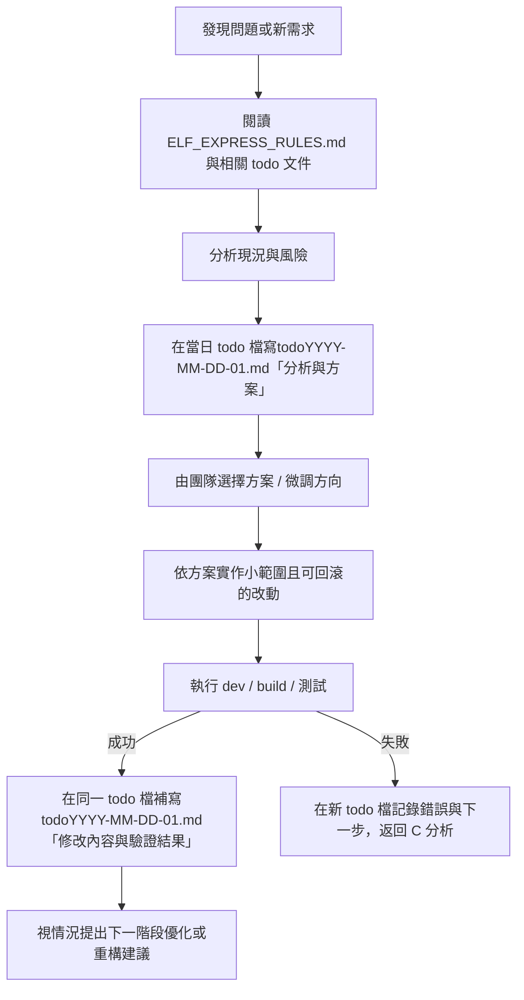

# TODO YYYY-MM-DD XX

## 主題：ELF EXPRESS 團隊開發流程圖（含 AI 協作）（Mermaid）

本檔用來描述 ELF EXPRESS 團隊在開發／除錯／重構時的**標準工作流程**。 AI 是其中一個協作成員，但流程本身也適用於純人工作業。

### 1. 協作流程（Mermaid）

### 2. 說明

- **官方標準優先**：
  - 在 C、D 兩個步驟，團隊（包含 AI）都應優先參考各框架／元件的官方文件與示例，避免偏離標準用法。
- **AI 是協作者，不是唯一決策者**：
  - AI 在 C、D 步驟可以主動指出：若照原需求做有什麼風險，並提供更安全或更易維護的替代方案。
  - E 步驟由團隊決定採用哪個方案，AI 提供資訊與建議即可。
- **人類與 AI 共同遵守 ELF_EXPRESS_RULES**：
  - 分兩個寫作階段：
    - D 節點：分析時先在當日 todo 檔寫入「分析與方案」。
    - H 節點：實作＋驗證後，在同一份 todo 檔補寫「修改內容與驗證結果」。
  - 整體流程都遵守 `docs/ELF_EXPRESS_RULES.md` 裡「最小改動、安全、可回滾、每日 todo md」的原則。
- **持續累積團隊知識**：
  - G、H、I 步驟的 todo 紀錄，會成為之後 ELF EXPRESS 團隊（不論人或 AI）一起 debug、重構的知識庫。

### 3. 今日 TODO 寫作範本（每個主題建一檔）

建議在 `todoYYYY-MM-DD-XX.md` 中，至少包含以下小節：

- **[問題標題]**

  - 一句話描述這次要處理的問題／需求，例如：
    - 「ColumnDesign 查詢欄位 datetime 無法調整精度」
    - 「v-code-diff 在 vite build 階段無法解析入口」

- **[背景與重現步驟]**

  - 說明發現問題的情境與步驟：
    - 進入哪個畫面、操作順序是什麼。
    - 若與 API 或 build 有關，附上關鍵指令與錯誤摘要。

- **[相關檔案路徑與定位]**

  - 使用專案相對路徑列出相關檔案，例如：
    - `src/components/ColumnDesign/src/components/Main.vue (約 L120–180，init 查詢欄位邏輯)`
    - `src/utils/jnpf.ts (getDataTypeText)`
    - `docs/ui-flow-datetime-refactor.md`
  - 若不容易給出精確行號，至少提供：函式名稱、元件名稱或關鍵註解文字，方便之後以全文搜尋找到。

- **[分析與方案]**

  - 說明目前對問題根因的判斷（若已知）。
  - 列出方案 A/B（含優缺點）以及預計採用的方案。

- **[實作重點摘要]**

  - 實作完成後，描述「改了什麼」而非貼整段 code：
    - 哪些函式／元件的行為被調整。
    - 是否引入／移除任何設定、alias、第三方套件。

- **[驗證與結果]**
  - 記錄實際跑過的指令與結果，例如：
    - `npm run dev`、`npm run build`、特定測試指令。
    - 成功／失敗；失敗時貼出第一個關鍵錯誤訊息片段。
  - 若還有未解問題，補上「下一步 TODO」。

> 提示：可以先在「分析與方案」階段填前半段（問題標題、背景、相關檔案、分析與方案），實作與驗證完成後再補寫「實作重點摘要」與「驗證與結果」，同一檔完成兩輪紀錄。
